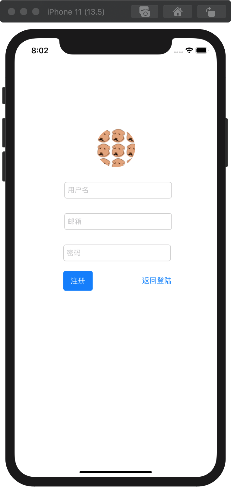
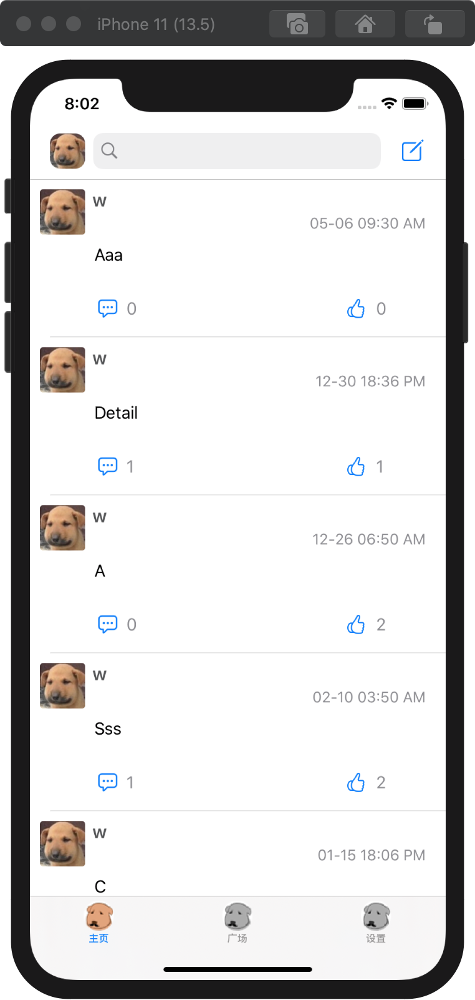
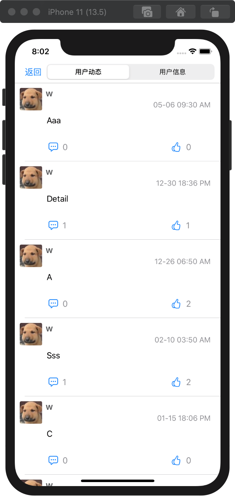
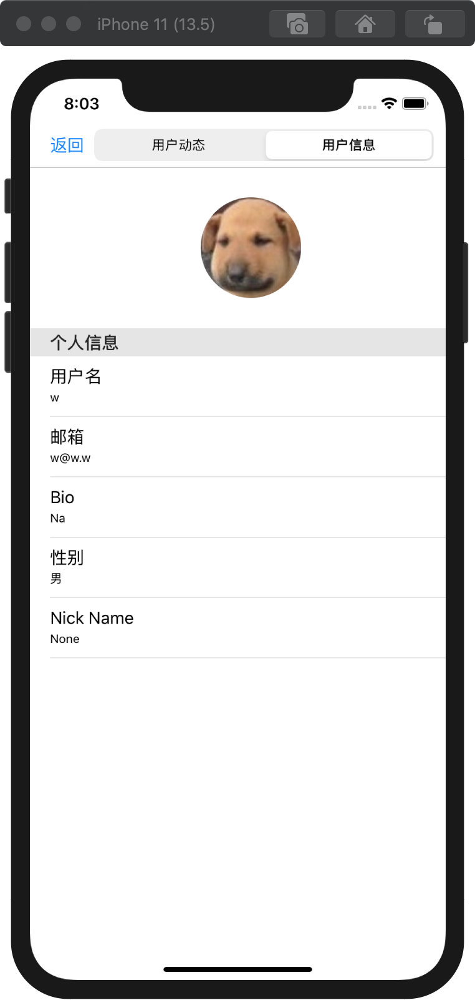
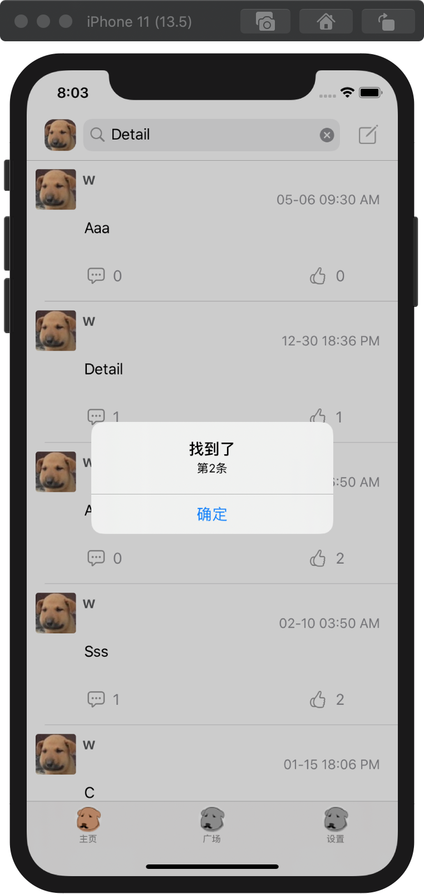
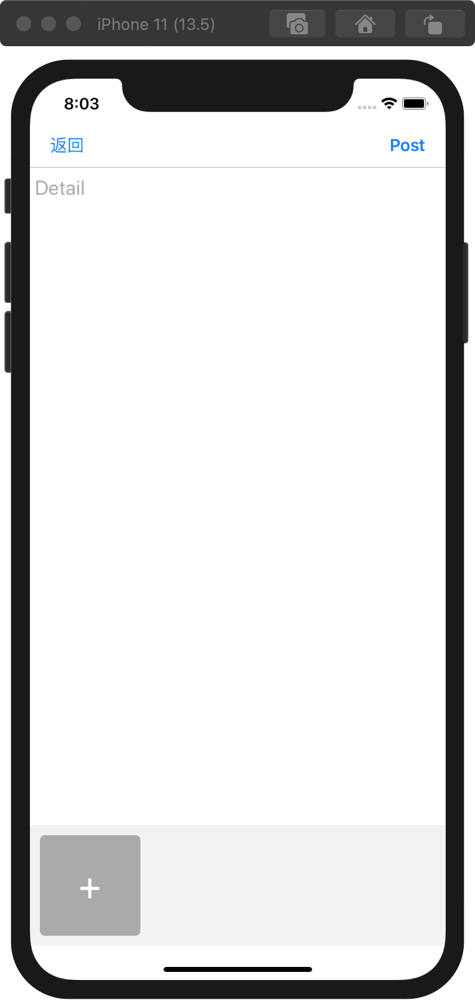
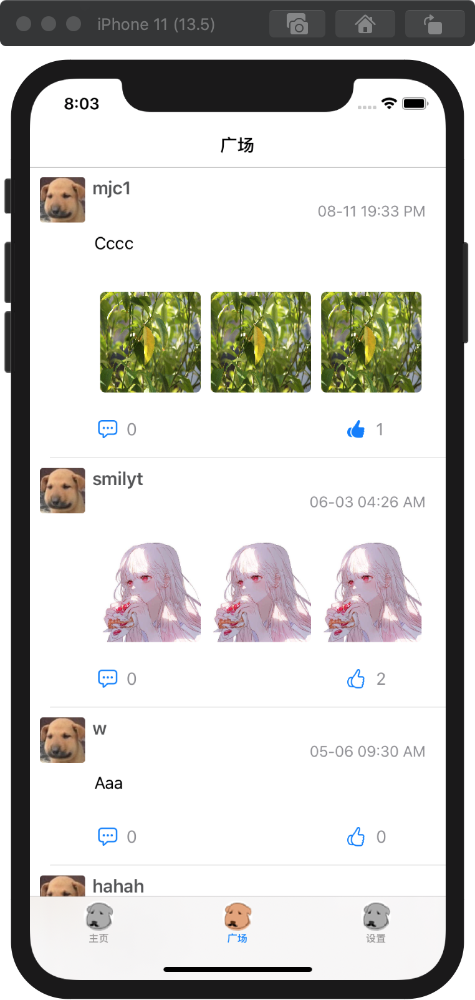
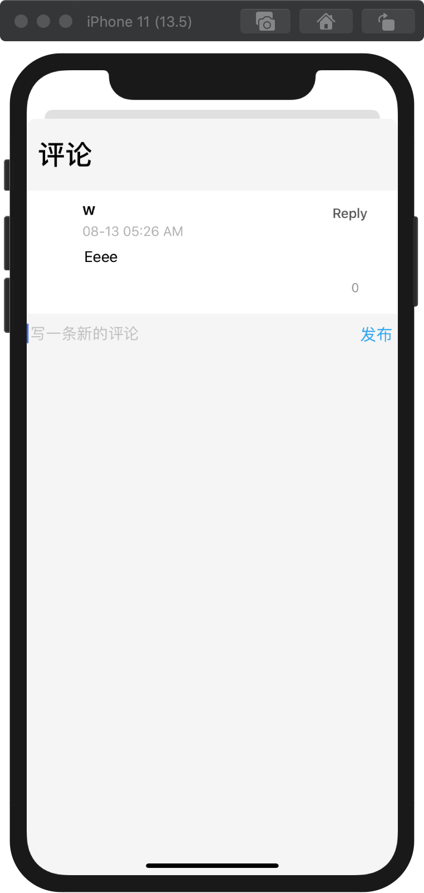
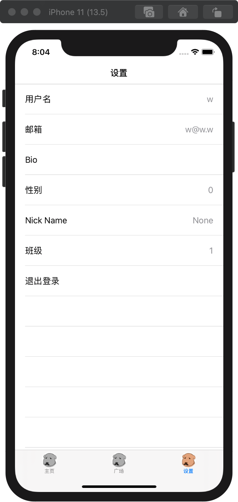
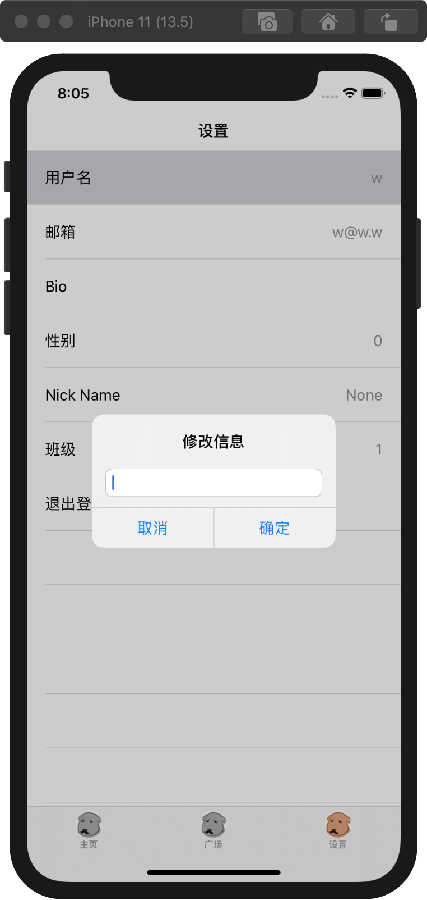

# 产品需求文档     

## 1. 文档综述
### 1.1 版本修订记录
修订时间|修订内容|修订人
--|--|--|
2020.12.29|撰写文档|刘忻曈

### 1.2 PRD输出环境
- 版本: v1.0
- 运行环境： MacOS 

### 1.3 产品介绍
此产品是一款基于Feeds信息流，以用户分享内容（UGC）的信息平台为定义的手机端校园资讯App，各大校园学生可以在此平台上发布分享内容、浏览其他用户的分享内容、与其他用户进行社交等。

## 2. 产品分析
### 2.1 用户需求分析
伴随着网络社交时代的兴起，更多的用户趋向于在网络平台分享生活、交友、讨论校园资讯，但有些需求可能在其他平台上未能得到很好的满足：
- 用户注重隐私，希望自己分享的内容仅在校友范围内可见；
- 用户希望同时能获取官方平台发布的信息和其他校友分享的生活经验等校园资讯；

### 2.2 用户定位
- 缺少时间或能力在现实生活种获取校内咨讯的在校学生、老师；
- 愿意在网络平台上展示与分享的互联网用户；
- 热衷于在网络平台上与其他同校学生交友的用户；

### 3. 功能结构
本产品主要分为四大模块：
- 个人主页模块  
    功能：查看本人信息、查看本人历史动态、按关键字搜索历史动态、发布新动态
- 广场模块  
    功能：按时间流查看发布在广场的动态、加载他人发布的图片、对动态进行评论和点赞
- 设置模块  
    功能：修改个人信息、登出账号
- 登录注册模块  
    功能：登录系统、注册新账号  

## 4. 用户操作说明
### 4.1 登录系统
#### 4.1.1 登录
进入app，输入账号、密码，点击登录按钮，即可完成登录操作。如下图：
  

#### 4.1.2 注册
首次登录需初始化信息。点击注册按钮，输入自定义用户名以及邮箱密码，即可完成注册操作。如下图：

### 4.2 个人主页
完成登录后，进入系统。点击下方TAB栏左边按钮，进入主页。

#### 4.2.1 查看历史动态
在主页中，可按发布时间倒序查看自己的历史动态。如下图：

#### 4.2.2 用户动态和信息
点击左上角头像或每条动态前的头像，可以查看自己的用户动态和用户信息。如下图：

点击左上角“返回”按钮，可回到主页。  

**编辑和删除用户动态：**

#### 4.2.3 搜索动态
在主页正上方的搜索框内，可按关键字搜索相应动态。如下图：
  

#### 4.2.4 发布动态
- 点击主页右上方按钮，可撰写动态并发布。  
- 点击下方“+”，可以为动态插入图片。  
- 编写完成后，点击右上方“Post”按钮可将动态发布到广场；点击左上方“返回”按钮可取消发布。  

如下图：

### 4.3 广场模块
点击下方TAB栏中间的按钮，进入广场模块。  
在广场中，可以按时间流查看所有用户发布在广场中的动态。  

#### 4.3.1 评论&点赞
点击每条动态下的“评论”和“点赞”按钮，可以对动态进行相应评论点赞操作。

评论界面如下：  

- 在下方“发布一条新的评论”内编写评论内容，点击发布，即可发布新评论
- 若要回复某条具体评论，则点击该评论旁的Reply按钮

#### 4.3.2 加载大图
点击动态中相应图片，即可加载清晰大图。如下图：

#### 4.3.3 查看其他用户信息
点击他人动态前的头像，即可查看TA的历史动态和个人信息。如下图：

### 4.4 设置模块
点击TAB栏最右边按钮，进入设置页。如下图：

#### 4.4.1 修改个人信息
点击需要修改的栏目，填写信息，点击“确认”完成修改；点击“取消”撤销操作。如下图：

#### 4.4.2 登出系统
点击最下方的“退出登录”，即可登出系统。